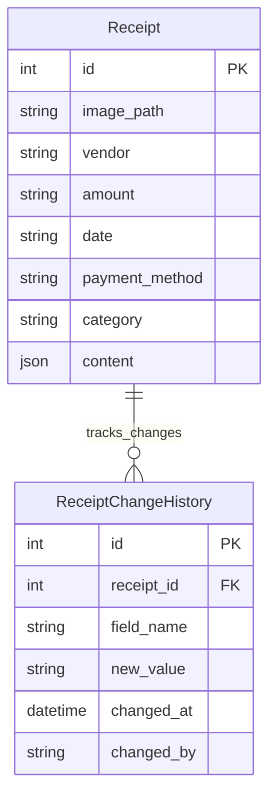
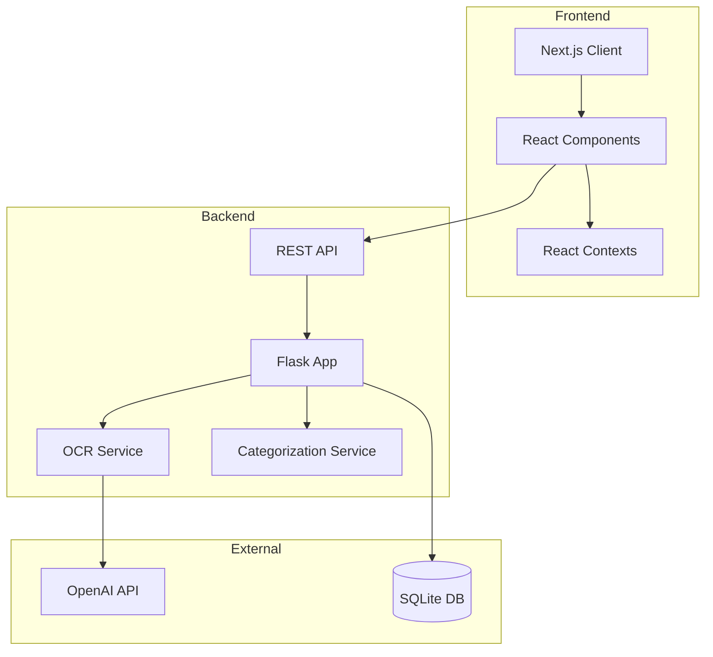

# Document Management System

A full-stack document management system built with Next.js and Flask, designed to handle various types of financial documents including W-2s, 1099s, expenses, and donations.

## Project Structure

```
├── frontend/
│   ├── components/
│   │   ├── Documents/                 # Document management components
│   │   │   ├── DocumentFilters.tsx    # Advanced filtering system
│   │   │   ├── DocumentUploadArea.tsx # Document upload UI/logic
│   │   │   ├── DocumentUploadFab.tsx  # Floating upload button
│   │   │   ├── DocumentsTable.tsx     # Main documents display
│   │   │   └── DocumentsTabs.tsx      # Document type navigation
│   │   ├── GlobalHeader/              # Application header
│   │   ├── LeftNav/                   # Navigation sidebar
│   │   ├── Layout/                    # Main layout wrapper
│   │   └── common/                    # Shared components
│   ├── contexts/                      # React contexts
│   │   └── SearchContext.tsx          # Global search state
│   ├── lib/                           # Shared utilities
│   │   └── api/                       # API client configuration
│   ├── .env.development              # Development environment variables
│   ├── .eslintrc.js                 # ESLint configuration
│   └── package.json                  # Frontend dependencies
├── backend/
│   ├── api/                         # API endpoints
│   │   └── routes.py                # Route handlers
│   ├── models/                      # Database models
│   │   └── database.py              # SQLAlchemy models
│   ├── services/                    # Business logic
│   │   ├── ocr_service.py          # OCR processing
│   │   └── categorization_service.py # Document categorization
│   ├── tests/                       # Test suites
│   ├── app.py                       # Flask application
│   ├── config.py                    # Configuration
│   └── requirements.txt             # Python dependencies
```

## Technologies Used

### Frontend
- **Framework**: Next.js 14
- **Language**: TypeScript
- **UI Library**: Material-UI (MUI) v5
- **State Management**: React Context
- **HTTP Client**: Axios
- **File Upload**: react-dropzone
- **Styling**: Emotion (CSS-in-JS)
- **Code Quality**: ESLint, Prettier

### Backend
- **Framework**: Flask
- **Database**: SQLite
- **ORM**: SQLAlchemy
- **OCR Processing**: OpenAI GPT-4 Vision API
- **Image Processing**: Pillow
- **Testing**: pytest
- **API Documentation**: OpenAPI/Swagger
- **WSGI Server**: gunicorn

## Frontend-Backend Integration

### API Configuration
- Backend runs on `http://localhost:3456`
- Frontend configured in `.env.development`:
  ```
  NEXT_PUBLIC_API_URL=http://localhost:3456
  NEXT_PUBLIC_API_TIMEOUT=120000
  ```

### API Endpoints
```
POST /api/upload              # Upload new document
GET /api/receipts            # List all documents
GET /api/receipts/{id}       # Get single document
DELETE /api/receipts/{id}    # Delete document
PATCH /api/receipts/{id}     # Update document
GET /api/images/{filename}   # Serve document images
```

## File Descriptions

### Frontend Components

#### Documents/
- `DocumentFilters.tsx`
  - Advanced filtering system for documents
  - Supports filtering by date, amount, vendor, status
  - Real-time filter updates

- `DocumentUploadArea.tsx`
  - Drag-and-drop file upload
  - Upload progress tracking
  - File validation
  - Error handling

- `DocumentsTable.tsx`
  - Displays documents in sortable table
  - Bulk selection operations
  - Real-time updates
  - Responsive design

#### Layout/
- `Layout.tsx`
  - Main application layout
  - Responsive sidebar
  - Header integration

#### Common/
- `DialogWrapper.tsx`
  - Reusable modal dialog
  - Standardized styling
  - Accessibility features

### Backend Components

#### api/routes.py
- RESTful API endpoints
- File upload handling
- Document CRUD operations
- Error handling
- Response formatting

#### models/database.py
- SQLAlchemy ORM models
- Document schema
- Database migrations
- Relationship definitions

#### services/
- `ocr_service.py`
  - OpenAI Vision API integration
  - Image preprocessing
  - Text extraction
  - Error handling

- `categorization_service.py`
  - Document type detection
  - Category assignment
  - Machine learning integration

## Setup Instructions

### Backend Setup
```bash
cd backend
python -m venv venv
source venv/bin/activate  # Windows: venv\Scripts\activate
pip install -r requirements.txt

# Create .env file:
OPENAI_API_KEY=your_key_here
UPLOAD_FOLDER=uploads
DB_PATH=data/documents.db

python app.py
```

### Frontend Setup
```bash
cd frontend
npm install
npm run dev
```

## Development Guidelines

### API Integration
- Use the `documentsApi` client in `frontend/lib/api/documents.ts`
- All API calls should include error handling
- Implement retry logic for failed requests
- Maintain consistent error response format

### State Management
- Use React Context for global state
- Implement local state for component-specific data
- Consider performance implications of context updates

### Testing
- Backend: Run tests with `pytest`
- Frontend: Component testing with React Testing Library
- API integration tests in `backend/tests/`

### Error Handling
- Implement proper error boundaries
- Use consistent error message format
- Log errors appropriately
- Provide user-friendly error messages

## Production Deployment

### Backend
- Use gunicorn for production server
- Implement proper logging
- Configure CORS appropriately
- Set up proper database backups

### Frontend
- Build with `npm run build`
- Implement proper caching strategies
- Configure CDN for static assets
- Set up proper environment variables

## Security Considerations
- Implement file type validation
- Set maximum file size limits
- Sanitize user inputs
- Implement rate limiting
- Use proper CORS configuration

## Performance Optimization
- Implement proper caching
- Use pagination for large datasets
- Optimize image processing
- Implement lazy loading
- Use proper indexing in database

## Monitoring and Logging
- Backend logging configuration
- Frontend error tracking
- Performance monitoring
- API usage tracking
- Database monitoring

## Known Limitations
- Maximum file size: 15MB
- Supported formats: JPEG, PNG
- Processing time varies with image quality
- Rate limits on OCR API

## Future Improvements
- Batch upload processing
- Advanced search capabilities
- Document version control
- Export functionality
- Dark mode support

## Database Schema

### Entity Relationship Diagram


## Architecture Overview

### High-Level System Architecture


## Technology Choices Rationale

### Frontend
- **Next.js**: Selected for:
  - Built-in routing system
  - Server-side rendering capabilities
  - API routes feature
  - Excellent TypeScript support
  - Strong developer ecosystem

- **Material-UI**: Chosen for:
  - Comprehensive component library
  - Customizable theming system
  - Enterprise-ready components
  - Accessibility compliance
  - Responsive design support

- **React Context**: Preferred over Redux because:
  - Simpler implementation for our scope
  - Built into React
  - Sufficient for our state management needs
  - Easier to maintain
  - Better performance for our use case

### Backend
- **Flask**: Selected for:
  - Lightweight and flexible
  - Easy integration with SQLAlchemy
  - Simple to extend
  - Great for microservices
  - Strong Python ecosystem

- **SQLite**: Chosen for:
  - Zero configuration needed
  - File-based database
  - Perfect for moderate data loads
  - Easy backup and maintenance
  - Built-in Python support

## React Context Structure

### SearchContext
Located in `frontend/contexts/SearchContext.tsx`:
```typescript
interface SearchContextType {
    searchQuery: string;
    setSearchQuery: (query: string) => void;
}
```
Purpose:
- Manages global search functionality
- Used by GlobalHeader for search input
- Filters DocumentsTable results
- Provides real-time search capabilities

Implementation:
```typescript
export const SearchProvider: React.FC = ({ children }) => {
    const [searchQuery, setSearchQuery] = useState('');
    
    return (
        <SearchContext.Provider value={{ searchQuery, setSearchQuery }}>
            {children}
        </SearchContext.Provider>
    );
};
```

## Styling Guidelines

### Theme Configuration
Located in `frontend/styles/theme.ts`:
```typescript
import { createTheme } from '@mui/material/styles';

export const theme = createTheme({
    palette: {
        primary: {
            main: '#1976d2',
            light: '#42a5f5',
            dark: '#1565c0'
        },
        secondary: {
            main: '#9c27b0',
            light: '#ba68c8',
            dark: '#7b1fa2'
        }
    },
    typography: {
        fontFamily: '"Roboto", "Helvetica", "Arial", sans-serif',
        h1: { fontSize: '2.5rem', fontWeight: 500 },
        h2: { fontSize: '2rem', fontWeight: 500 },
        h3: { fontSize: '1.75rem', fontWeight: 500 }
    },
    shape: {
        borderRadius: 8
    }
});
```

### Styling Best Practices

1. **Component-Level Styling**
   ```typescript
   // Use MUI's sx prop for component-specific styles
   <Box
       sx={{
           display: 'flex',
           gap: 2,
           p: 2,
           borderRadius: 1,
           bgcolor: 'background.paper'
       }}
   >
   ```

2. **Reusable Styled Components**
   ```typescript
   const StyledDialog = styled(Dialog)(({ theme }) => ({
       '& .MuiDialog-paper': {
           borderRadius: theme.shape.borderRadius * 2,
           padding: theme.spacing(2)
       }
   }));
   ```

3. **Responsive Design**
   ```typescript
   <Box
       sx={{
           width: {
               xs: '100%',    // 0-600px
               sm: '50%',     // 600-900px
               md: '33.33%'   // 900px+
           }
       }}
   >
   ```

### Theme Customization

1. **Extending the Theme**
   ```typescript
   const customTheme = createTheme(theme, {
       components: {
           MuiButton: {
               styleOverrides: {
                   root: {
                       borderRadius: 20
                   }
               }
           }
       }
   });
   ```

2. **Adding Custom Colors**
   ```typescript
   declare module '@mui/material/styles' {
       interface Palette {
           custom: {
               main: string;
               light: string;
               dark: string;
           };
       }
       interface PaletteOptions {
           custom?: {
               main: string;
               light: string;
               dark: string;
           };
       }
   }
   ```

### Global Style Guidelines

1. **Spacing**
   - Use theme.spacing() for consistent spacing
   - Follow 8px grid system
   - Use MUI's built-in spacing props

2. **Colors**
   - Use palette colors from theme
   - Avoid hardcoded color values
   - Use semantic color names

3. **Typography**
   - Use MUI's typography variants
   - Maintain consistent font hierarchy
   - Use responsive font sizes

4. **Layout**
   - Use MUI Grid system for layouts
   - Implement responsive breakpoints
   - Follow mobile-first approach