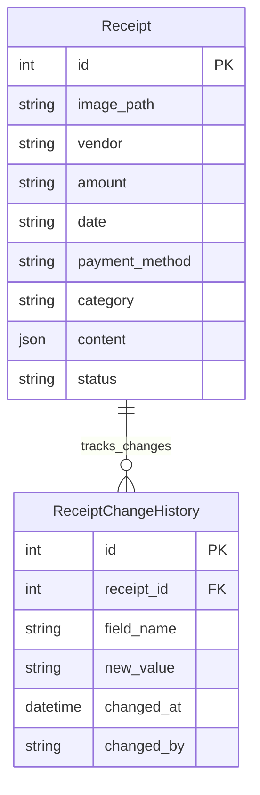
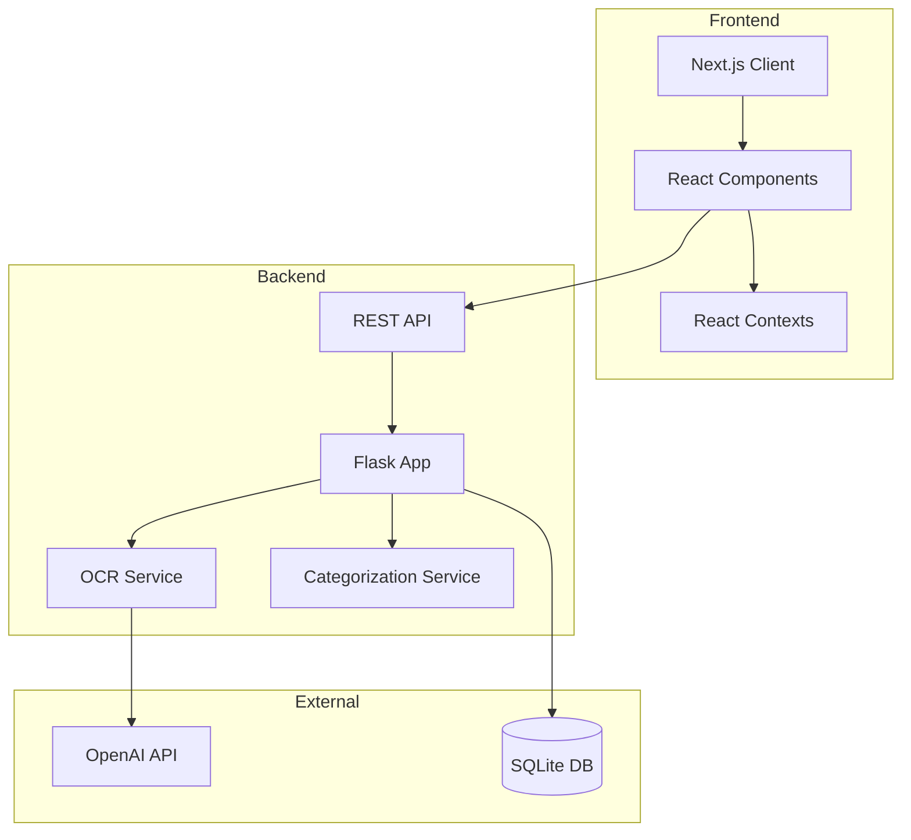

# Document Management System

A full-stack document management system built with Next.js and Flask, designed to handle various types of financial documents including W-2s, 1099s, expenses, and donations. The system features OCR capabilities powered by OpenAI's GPT-4 Vision API for automated document processing.

## Project Structure

```
├── frontend/
│   ├── components/
│   │   ├── Documents/              # Document management components
│   │   │   ├── DocumentFilters     # Advanced filtering system
│   │   │   ├── DocumentUploadArea  # Document upload UI/logic
│   │   │   ├── DocumentUploadFab   # Floating upload button
│   │   │   ├── DocumentsTable      # Main documents display
│   │   │   └── DocumentsTabs       # Document type navigation
│   │   ├── GlobalHeader/           # Application header
│   │   ├── LeftNav/               # Navigation sidebar
│   │   ├── Layout/                # Main layout wrapper
│   │   └── common/                # Shared components
│   ├── contexts/                  # React contexts
│   │   └── SearchContext         # Global search state
│   ├── lib/                      # Shared utilities
│   │   └── api/                  # API client configuration
│   └── styles/                   # Global styles and theme
├── backend/
│   ├── api/                      # API endpoints
│   │   └── routes.py            # Route handlers
│   ├── models/                   # Database models
│   │   └── database.py          # SQLAlchemy models
│   ├── services/                # Business logic
│   │   ├── ocr_service.py      # OCR processing
│   │   └── categorization_service.py # Document categorization
│   └── tests/                   # Test suites
```

## Technologies Used

### Frontend
- **Framework**: Next.js 14 (chosen for its built-in routing, SSR capabilities, and TypeScript support)
- **Language**: TypeScript
- **UI Library**: Material-UI v5 (chosen for comprehensive component library and enterprise-ready features)
- **State Management**: React Context (preferred over Redux for simpler implementation and better performance)
- **HTTP Client**: Axios
- **File Upload**: react-dropzone
- **Styling**: Emotion (CSS-in-JS)

### Backend
- **Framework**: Flask (chosen for its lightweight nature and microservices compatibility)
- **Database**: SQLite (chosen for zero configuration and easy maintenance)
- **ORM**: SQLAlchemy
- **OCR Processing**: OpenAI GPT-4 Vision API
- **Image Processing**: Pillow
- **Testing**: pytest
- **Documentation**: OpenAPI/Swagger

## Frontend-Backend Integration

### API Configuration
- Backend runs on `http://localhost:3456`
- Frontend configured in `.env.development`:
```
NEXT_PUBLIC_API_URL=http://localhost:3456
NEXT_PUBLIC_API_TIMEOUT=120000
```

### API Endpoints
```
POST /api/upload              # Upload new document
GET /api/receipts            # List all documents
GET /api/receipts/{id}       # Get single document
DELETE /api/receipts/{id}    # Delete document
PATCH /api/receipts/{id}     # Update document
GET /api/images/{filename}   # Serve document images
```

## Database Schema



## Architecture Overview



## React Context Structure

### SearchContext
Located in `frontend/contexts/SearchContext.tsx`:
```typescript
interface SearchContextType {
    searchQuery: string;
    setSearchQuery: (query: string) => void;
}
```
Purpose:
- Manages global search functionality
- Used by GlobalHeader for search input
- Filters DocumentsTable results
- Provides real-time search capabilities

## Styling Guidelines

### Theme Configuration
Located in `frontend/styles/theme.ts`:
```typescript
export const theme = createTheme({
    palette: {
        primary: {
            main: '#1976d2',
            light: '#42a5f5',
            dark: '#1565c0'
        },
        secondary: {
            main: '#9c27b0',
            light: '#ba68c8',
            dark: '#7b1fa2'
        }
    },
    typography: {
        fontFamily: '"Roboto", "Helvetica", "Arial", sans-serif',
        h1: { fontSize: '2.5rem', fontWeight: 500 },
        h2: { fontSize: '2rem', fontWeight: 500 },
        h3: { fontSize: '1.75rem', fontWeight: 500 }
    }
});
```

### Styling Best Practices

1. **Component-Level Styling**
   ```typescript
   <Box
       sx={{
           display: 'flex',
           gap: 2,
           p: 2,
           borderRadius: 1,
           bgcolor: 'background.paper'
       }}
   >
   ```

2. **Reusable Styled Components**
   ```typescript
   const StyledDialog = styled(Dialog)(({ theme }) => ({
       '& .MuiDialog-paper': {
           borderRadius: theme.shape.borderRadius * 2,
           padding: theme.spacing(2)
       }
   }));
   ```

3. **Responsive Design**
   ```typescript
   <Box
       sx={{
           width: {
               xs: '100%',    // 0-600px
               sm: '50%',     // 600-900px
               md: '33.33%'   // 900px+
           }
       }}
   >
   ```

## Key Components

### Documents/
- `DocumentFilters.tsx`: Advanced filtering system with support for multiple filter types
- `DocumentUploadArea.tsx`: Drag-and-drop file upload with progress tracking
- `DocumentsTable.tsx`: Main document display with sorting and filtering
- `DocumentsTabs.tsx`: Navigation between document types

### Services/
- `ocr_service.py`: Handles document OCR using OpenAI's GPT-4 Vision API
- `categorization_service.py`: Automatically categorizes documents based on content

## Development Guidelines

### API Integration
- Use the `documentsApi` client in `frontend/lib/api/documents.ts`
- All API calls should include error handling
- Implement retry logic for failed requests
- Maintain consistent error response format

### State Management
- Use React Context for global state
- Implement local state for component-specific data
- Consider performance implications of context updates

### Testing
- Backend: Run tests with `pytest`
- Frontend: Component testing with React Testing Library
- API integration tests in `backend/tests/`

## Security Considerations
- Implement file type validation
- Set maximum file size limits
- Sanitize user inputs
- Implement rate limiting
- Use proper CORS configuration

## Performance Optimization
- Implement proper caching
- Use pagination for large datasets
- Optimize image processing
- Implement lazy loading
- Use proper indexing in database

## API Documentation

### Document Upload
```
POST /api/upload
Content-Type: multipart/form-data

Request:
- file: File (required) - Image file (JPEG, PNG)

Response:
{
    "id": number,
    "image_path": string,
    "vendor": string,
    "amount": string,
    "date": string,
    "payment_method": string,
    "category": string,
    "content": object
}

Errors:
- 400: Invalid file type or size
- 500: Processing error
```

### List Documents
```
GET /api/receipts
Query Parameters:
- type: string (optional) - Filter by document type (W-2, 1099, Expenses, Donations)
- status: string (optional) - Filter by status (pending, approved, rejected)

Response:
[{
    "id": number,
    "image_path": string,
    "vendor": string,
    "amount": string,
    "date": string,
    "payment_method": string,
    "category": string,
    "content": object,
    "status": string
}]
```

### Get Single Document
```
GET /api/receipts/{id}

Response:
{
    "id": number,
    "image_path": string,
    "vendor": string,
    "amount": string,
    "date": string,
    "payment_method": string,
    "category": string,
    "content": object,
    "status": string
}

Errors:
- 404: Document not found
```

### Update Document
```
PATCH /api/receipts/{id}
Content-Type: application/json

Request Body:
{
    "vendor"?: string,
    "amount"?: string,
    "date"?: string,
    "payment_method"?: string,
    "category"?: string,
    "status"?: string
}

Response:
{
    "success": boolean,
    "receipt_id": number,
    "updated_fields": object,
    "updated_at": string
}

Errors:
- 400: Invalid field values
- 404: Document not found
```

### Delete Document
```
DELETE /api/receipts/{id}

Response:
{
    "message": "Receipt deleted successfully"
}

Errors:
- 404: Document not found
```

### Get Document Image
```
GET /api/images/{filename}

Response:
- Image file (JPEG/PNG)

Errors:
- 404: Image not found
```

### Get Document History
```
GET /api/receipts/{id}/history

Response:
[{
    "field": string,
    "new_value": string,
    "changed_at": string,
    "changed_by": string
}]

Errors:
- 404: Document not found
```

### API Error Response Format
All API errors follow this structure:
```json
{
    "error": string,
    "details"?: string | object,
    "code"?: string
}
```

### API Rate Limits
- Upload endpoint: 10 requests per minute
- Other endpoints: 100 requests per minute
- Image serving: 1000 requests per minute

### API Authentication
Currently using CORS for security. Future versions will implement JWT authentication.

### API Versioning
API version is currently v1 (implicit). Future versions will use explicit versioning in the URL path.