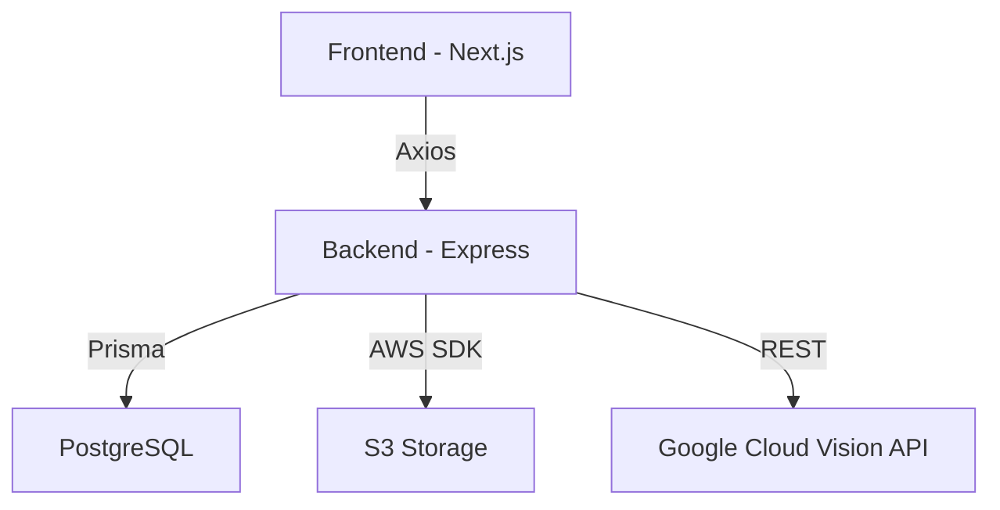

# Ten40 Document Management System

A modern document management system built for handling tax documents, receipts, and financial records with OCR capabilities.

## Project Structure 
## Technologies Used

### Frontend
- **React 18** with TypeScript
- **Next.js** for SSR and routing
- **Material-UI (MUI)** for UI components
- **Axios** for API calls
- **React Context** for state management
- **date-fns** for date manipulation

### Backend
- **Node.js** with Express
- **PostgreSQL** for database
- **Prisma** as ORM
- **Jest** for testing
- **AWS S3** for document storage
- **Google Cloud Vision API** for OCR

## API Integration

### Base Configuration
- Development API URL: `http://localhost:3456`
- API timeout: 120000ms
- All API calls use Axios with centralized error handling

### API Client Structure
- `apiClient.ts`: Configures Axios instance with base URL and interceptors
- `documents.ts`: Contains all document-related API methods
- Error handling through custom `ApiError` class

The project uses a centralized API client architecture with Axios:

#### 1. Base API Client (`frontend/services/apiClient.ts`)

#### 2. Document API Methods (`frontend/lib/api/documents.ts`)

## Component Documentation

### Document Filtering

#### DocumentFilters.tsx
- Purpose: Provides filtering UI for all document types
- Features:
  - Multi-select filters
  - Date range selection
  - Amount range filtering
- API Integration:
  ```typescript
  const { data } = await apiClient.get<FilterOptions>('/options');
  ```

#### ExpenseFilters.tsx
- Purpose: Expense-specific filtering interface
- Additional Features:
  - Vendor filtering
  - Payment method selection
  - Category filtering
- API Integration:
  ```typescript
  const { data } = await apiClient.get<FilterOptions>('/options');
  ```

### Receipt Management

#### ReceiptList.tsx
- Purpose: Displays and manages receipt documents
- Features:
  - Sortable columns
  - Bulk actions
  - Delete functionality
- API Integration:
  ```typescript
  // Fetch receipts
  const { data } = await apiClient.get<Receipt[]>('/receipts');
  
  // Delete receipt
  await apiClient.delete(`/receipts/${id}`);
  ```

#### ReceiptUploader.tsx
- Purpose: Handles receipt file uploads
- Features:
  - Drag and drop support
  - File validation
  - Upload progress tracking
- API Integration:
  ```typescript
  const { data } = await apiClient.post('/upload', formData, {
      headers: { 'Content-Type': 'multipart/form-data' }
  });
  ```

## Database Schema 

## Architecture



## Design Decisions

### Frontend
1. **MUI**: Chosen for comprehensive component library and theming
2. **Axios**: Selected for:
   - Better error handling
   - Request/response interceptors
   - TypeScript support
3. **Context API**: Used over Redux for:
   - Simpler state management
   - Built-in React feature
   - Sufficient for app complexity

### Backend
1. **Microservices Architecture**:
   - Scalability
   - Service isolation
   - Independent deployment
2. **PostgreSQL**:
   - ACID compliance
   - JSON support
   - Complex query capabilities

## Context Structure

### DocumentContext
- Manages document list state
- Handles filtering logic
- Provides document CRUD operations

### UploadContext
- Manages upload state
- Handles file validation
- Tracks upload progress

## Styling Guidelines

### Theme Configuration
```typescript
const theme = createTheme({
  palette: {
    primary: {
      main: '#1976d2'
    },
    // ... other theme values
  }
});
```

### Global Styles
- Use MUI's `sx` prop for component-specific styling
- Global styles in `styles/globals.css`
- Responsive breakpoints follow MUI's standard

## API Endpoints

### Documents
- `GET /api/documents` - List documents
- `POST /api/documents` - Create document
- `PATCH /api/documents/:id` - Update document
- `DELETE /api/documents/:id` - Delete document

### Receipts
- `GET /api/receipts` - List receipts
- `POST /api/upload` - Upload receipt
- `GET /api/receipts/:id` - Get receipt details
- `DELETE /api/receipts/:id` - Delete receipt

## Testing

### Frontend Tests
- Jest for unit testing
- React Testing Library for component tests
- Cypress for E2E testing

### Backend Tests
- Jest for unit tests
- Supertest for API testing
- Integration tests with test database

### Running Tests
```bash
# Frontend tests
cd frontend
npm test

# Backend tests
cd backend
npm test
```

## Getting Started

1. Clone repository
2. Install dependencies:
```bash
cd frontend && npm install
cd backend && npm install
```

3. Set up environment variables:
```bash
cp frontend/.env.example frontend/.env.local
cp backend/.env.example backend/.env
```

4. Start development servers:
```bash
# Frontend
npm run dev

# Backend
npm run dev
```

## Contributing

1. Follow existing patterns
2. Use TypeScript strictly
3. Write tests for new features
4. Update documentation

### API Endpoints Used

| Endpoint | Method | Purpose | Used In |
|----------|--------|---------|----------|
| `/receipts` | GET | Fetch receipts list | ReceiptList.tsx |
| `/upload` | POST | Upload new receipt | ReceiptUploader.tsx |
| `/receipts/:id` | DELETE | Delete receipt | ReceiptList.tsx |
| `/options` | GET | Fetch filter options | DocumentFilters.tsx, ExpenseFilters.tsx |

### Error Handling

All API calls use a standardized error handling approach: 
```

## Testing

### API Integration Tests
- Test files are located alongside components
- Focus on testing API integration points
- Mock Axios responses for predictable tests

Example test:
```typescript
describe('documentsApi', () => {
    it('should fetch documents successfully', async () => {
        const documents = await documentsApi.getDocuments('Expenses');
        expect(documents).toBeDefined();
    });
});
```

## Best Practices

1. **API Calls**
   - Always use the centralized apiClient
   - Handle errors consistently
   - Type all responses

2. **Component Integration**
   - Use loading states during API calls
   - Implement error boundaries
   - Show feedback for user actions

3. **Data Management**
   - Cache responses when appropriate
   - Implement optimistic updates
   - Handle stale data scenarios
