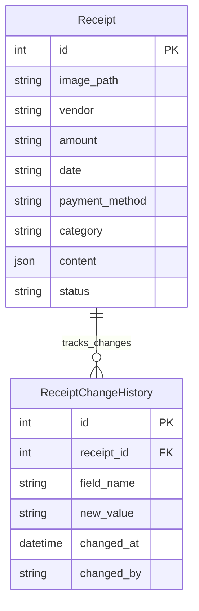
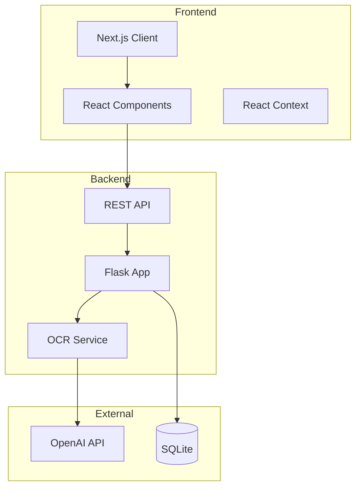

# Document Management System

## 1. Project Structure

```
├── frontend/
│   ├── components/
│   │   ├── Documents/              # Document management components
│   │   ├── GlobalHeader/           # Application header
│   │   ├── LeftNav/                # Navigation sidebar
│   │   ├── Layout/                 # Main layout wrapper
│   │   └── common/                 # Shared components
│   ├── contexts/                   # React contexts
│   ├── styles/                     # Global styles
│   ├── .env.development            # Environment variables for development
│   ├── .eslintrc.js                # ESLint configuration
│   └── .gitignore                  # Files to ignore in version control
├── backend/
│   ├── api/
│   │   └── routes.py               # API endpoints
│   ├── models/
│   │   └── database.py             # Database models
│   ├── services/
│   │   ├── ocr_service.py          # OCR processing
│   │   └── categorization.py       # Document categorization
│   ├── tests/                      # Test suites
│   │   ├── conftest.py             # Test configuration and fixtures
│   │   ├── test_api.py             # API endpoint tests
│   │   ├── test_migrations.py      # Database migration tests
│   │   └── test_receipt_updates.py # Receipt update tests
│   └── .env                        # Environment variables for backend
```

## 2. Technologies Used

### Frontend
- **Next.js 14**: React framework for server-side rendering and static site generation.
- **TypeScript**: Type safety and improved developer experience.
- **Material-UI v5**: UI component library for React.
- **React Context**: State management.
- **Axios**: HTTP client for making API requests.
- **react-dropzone**: File upload handling.

### Backend
- **Flask**: Lightweight Python web framework.
- **SQLAlchemy**: ORM for database interactions.
- **SQLite**: Simple, file-based database.
- **OpenAI GPT-4 Vision API**: OCR processing.
- **pytest**: Testing framework.
- **Pillow**: Image processing library.

## 3. Frontend-Backend Integration

- **Backend** runs on port 3456 (`http://localhost:3456`).
- **Frontend** is configured in `.env.development`:
  ```
  NEXT_PUBLIC_API_URL=http://localhost:3456
  NEXT_PUBLIC_API_TIMEOUT=120000
  ```
- **API calls** are handled through Axios client.
- **CORS** is enabled for development.

## 4. File Purposes and Functionality

### Frontend Key Files
- **`DocumentsTable.tsx`**: Displays and manages documents.
- **`DocumentFilters.tsx`**: Implements advanced document filtering.
- **`DocumentUploadArea.tsx`**: Handles document upload UI and logic.
- **`GlobalHeader.tsx`**: Application header with search functionality.
- **`LeftNav.tsx`**: Navigation sidebar component.

### Backend Key Files
- **`routes.py`**: API endpoint definitions and request handling.
- **`database.py`**: SQLAlchemy models and database configuration.
- **`ocr_service.py`**: OpenAI GPT-4 integration for document processing.
- **`test_receipt_updates.py`**: Tests for receipt update functionality.
- **`test_migrations.py`**: Database migration tests.

## 5. Database Schema (ERD)



## 6. Architecture Diagram



## 7. Technology Choices Rationale

- **Next.js**: Chosen for SSR capabilities and built-in routing.
- **Flask**: Selected for its lightweight nature and microservices compatibility.
- **SQLite**: Zero configuration and easy maintenance.
- **Material-UI**: Comprehensive component library with enterprise features.
- **React Context**: Preferred over Redux for simpler state management.

## 8. React Context Structure

```typescript
interface SearchContextType {
    searchQuery: string;
    setSearchQuery: (query: string) => void;
}
```

Purpose:
- Manages global search functionality.
- Used by GlobalHeader for search input.
- Filters DocumentsTable results.
- Provides real-time search capabilities.

## 9. Styling Guidelines

```typescript
export const theme = createTheme({
    palette: {
        primary: {
            main: '#1976d2',
            light: '#42a5f5',
            dark: '#1565c0'
        }
    },
    typography: {
        fontFamily: '"Roboto", "Helvetica", "Arial", sans-serif',
        h1: { fontSize: '2.5rem', fontWeight: 500 }
    }
});
```

## 10. Backend API Endpoints

```python
@api_bp.route('/api/receipts', methods=['GET'])
@api_bp.route('/api/receipts/<int:receipt_id>', methods=['GET'])
@api_bp.route('/api/upload', methods=['POST'])
@api_bp.route('/api/receipts/<int:receipt_id>', methods=['PATCH'])
@api_bp.route('/api/receipts/<int:receipt_id>', methods=['DELETE'])
```

## 11. Testing

### Test Structure

```
backend/tests/
├── conftest.py          # Test configuration and fixtures
├── test_api.py          # API endpoint tests
├── test_migrations.py   # Database migration tests
└── test_receipt_updates.py  # Receipt update tests
```

### Running Tests

```bash
# Run all tests
python -m pytest

# Run with coverage
python -m pytest --cov=backend

# Run specific test file
python -m pytest backend/tests/test_api.py
```

### Test Categories

- **Unit Tests**: Individual component testing.
- **Integration Tests**: End-to-end functionality.
- **Migration Tests**: Database schema verification.
- **API Tests**: Endpoint functionality verification.