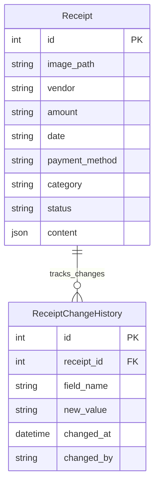

[Previous README.md content remains unchanged until the end...]

## New Feature: Editable Receipt Fields

### Overview
This feature enables users to edit receipt fields directly from the documents table interface. Editable fields include:
- Vendor name
- Amount
- Date
- Payment method
- Expense category
- Status

### API Design

#### Enhanced Update Endpoint
The existing `PATCH /api/receipts/{id}` endpoint will be enhanced to support field updates with proper validation and audit logging.

```
PATCH /api/receipts/{id}
```

Request Body:
```json
{
  "vendor": "New Vendor Name",
  "amount": "150.00",
  "date": "2024-03-20",
  "payment_method": "credit_card",
  "category": "office_supplies",
  "status": "approved"
}
```

Response (200 OK):
```json
{
  "success": true,
  "receipt_id": "123",
  "updated_fields": {
    "vendor": "New Vendor Name",
    "amount": "150.00",
    "date": "2024-03-20",
    "payment_method": "credit_card",
    "category": "office_supplies",
    "status": "approved"
  },
  "updated_at": "2024-03-20T15:30:00Z"
}
```

#### Field Validation Rules

1. **Vendor**
   - Type: string
   - Length: 1-100 characters
   - Allowed characters: alphanumeric, spaces, common punctuation
   - Required field

2. **Amount**
   - Type: string (decimal)
   - Format: Valid decimal number
   - Range: 0.01 to 999999.99
   - Required field

3. **Date**
   - Type: string
   - Format: ISO 8601 (YYYY-MM-DD)
   - Range: Not future dates
   - Required field

4. **Payment Method**
   - Type: string
   - Valid values: ["credit_card", "debit_card", "cash", "check", "wire_transfer", "other"]
   - Required field

5. **Category**
   - Type: string
   - Valid values: ["office_supplies", "travel", "meals", "utilities", "software", "hardware", "other"]
   - Required field

6. **Status**
   - Type: string (enum)
   - Valid values: ["pending", "approved", "rejected"]
   - Default: "pending" (on receipt creation)
   - Required field
   - Case-insensitive validation
   - Transitions:
     - "pending" → "approved" or "rejected"
     - "approved" → "rejected"
     - "rejected" → "approved"

#### Error Responses

```json
{
  "error": {
    "code": "VALIDATION_ERROR",
    "message": "Invalid field values",
    "details": {
      "amount": "Amount must be a valid decimal number",
      "date": "Date cannot be in the future"
    }
  }
}
```

Error Codes:
- `VALIDATION_ERROR`: Invalid field values
- `NOT_FOUND`: Receipt not found
- `UNAUTHORIZED`: User not authorized
- `INTERNAL_ERROR`: Server error

### Implementation Details

#### Backend Changes

1. **Enhanced Route Handler**
```python
@app.route('/api/receipts/<int:receipt_id>', methods=['PATCH'])
@validate_request
def update_receipt(receipt_id):
    """Update receipt fields with validation and audit logging"""
    pass
```

2. **Validation Middleware**
```python
def validate_request(f):
    """Decorator to validate request body against schema"""
    pass
```

3. **Field Validation Schema**
```python
FIELD_VALIDATION_SCHEMA = {
    "vendor": {
        "type": "string",
        "required": True,
        "maxlength": 100
    },
    # ... other field validations
}
```

### Testing Strategy

#### API Tests

1. **Field Validation Tests**
```python
def test_update_receipt_validation():
    """Test field validation rules"""
    pass
```

2. **Success Case Tests**
```python
def test_update_receipt_success():
    """Test successful field updates"""
    pass
```

3. **Error Case Tests**
```python
def test_update_receipt_errors():
    """Test various error conditions"""
    pass
```

4. **Partial Update Tests**
```python
def test_partial_update_receipt():
    """Test updating subset of fields"""
    pass
```

#### Test Coverage Requirements
- All validation rules
- All error conditions
- Successful updates
- Partial updates
- Authorization checks
- Edge cases (empty fields, boundary values)

### Security Considerations

1. **Input Validation**
   - Strict validation of all input fields
   - Prevention of SQL injection
   - XSS protection

2. **Authorization**
   - User must be authenticated
   - User must have permission to edit receipts
   - Audit logging of all changes

3. **Rate Limiting**
   - Maximum 100 requests per minute per user
   - Prevents abuse of the API

### Performance Considerations

1. **Database Optimization**
   - Indexed fields for quick lookups
   - Efficient update queries
   - Support for partial updates

2. **Caching Strategy**
   - Cache validation rules
   - Cache frequently accessed receipts

3. **Response Time Goals**
   - 95th percentile response time < 200ms
   - 99th percentile response time < 500ms

### Monitoring and Logging

1. **Audit Trail**
   - Log all field changes
   - Track who made changes and when
   - Maintain history of changes

2. **Performance Metrics**
   - Track response times
   - Monitor error rates
   - Alert on anomalies

3. **Usage Analytics**
   - Track most commonly edited fields
   - Monitor usage patterns
   - Identify potential improvements

## Database Schema

### Entity Relationship Diagram


### Receipt Status Field
The Receipt model includes a status field with the following specifications:
- Type: string (enum)
- Default value: "pending"
- Allowed values: ["pending", "approved", "rejected"]
- Not extracted from OCR
- Tracks changes in ReceiptChangeHistory

[Rest of README.md content remains unchanged...] 